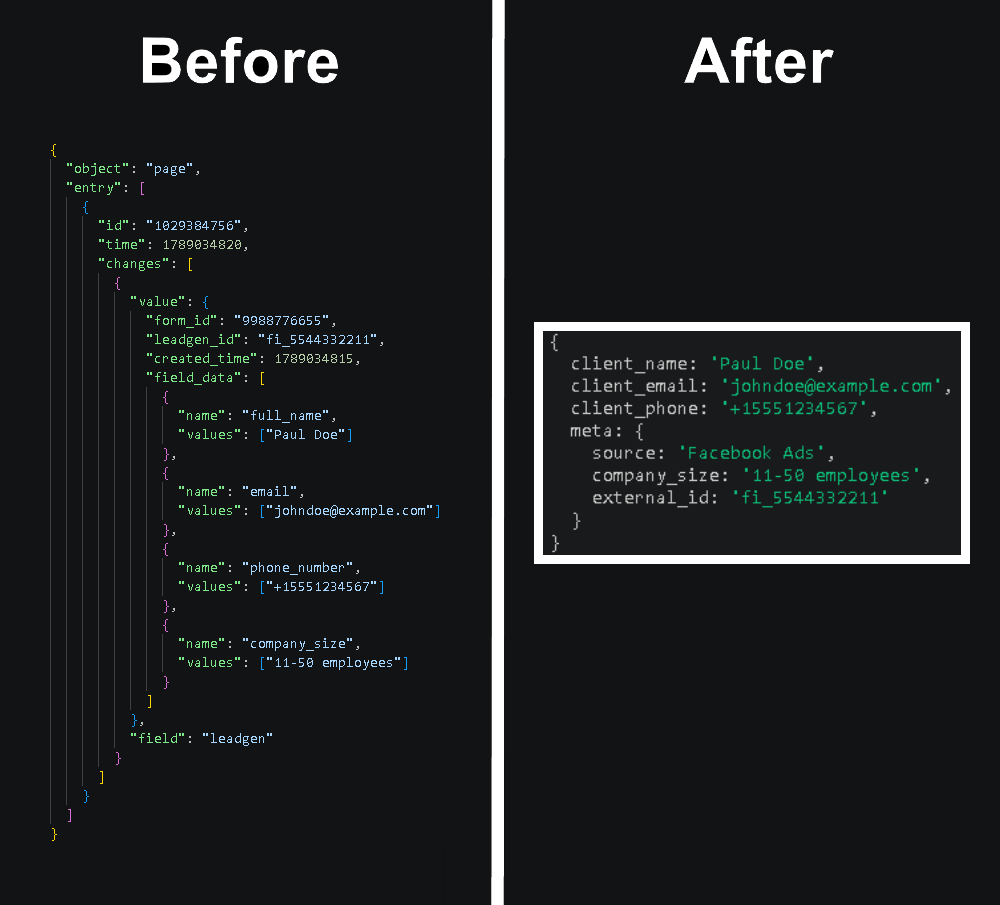

# Leeds Converter and Webhook Receiver

**A production-ready Node.js middleware designed to act as an intermediate server, automatically receiving, validating, and formatting chaotic raw webhook payloads into clean data for CRM APIs.**

---

## The Problem
When running digital marketing campaigns across platforms like Meta Ads (Facebook Ads) or Google Ads, managing lead capture can be structurally chaotic. The webhook payloads generated by these ad platforms do not match the strict schema requirements of destination systems like modern CRMs.

Common integration blockers include:
*   **Deeply Nested JSON Arrays:** Critical contact data trapped inside complex structures (e.g., `entry.changes.value.field_data`).
*   **Volatile Field Ordering:** Payload keys that change sequence depending on the form layout.
*   **Fragile Deliveries:** Malformed hook requests causing backend loops or script crashes due to lack of standard payload validation.
*   **Leaked Credentials:** Accidentally hardcoding destination CRM API URLs and severe environment settings inside the source control code.

---

## The Solution
This intermediate service sits between the ad platforms and your CRM. It exposes a secure `POST` endpoint to filter incoming requests, process array search lookups efficiently, construct sanitized telemetry, and stream structured payloads to the destination system.



### What this tool automatically handles for you:
*   **Robust Payload Validation:** Immediately drops broken, incomplete, or malformed webhook hits with an HTTP `400 Bad Request` before invoking business logic.
*   **Smart In-Memory Extraction:** Utilizes optimized JavaScript array search routines (`.find()`) to parse specific keys independent of their position in the raw incoming data stack.
*   **Fault-Tolerant Mapping:** Implements defensive conditional checks to map non-existent values safely into uniform fallback strings (`'N/A'`) preventing production route failure.
*   **Isolated Environments:** Separates internal logic parameters completely from production properties via operational `.env` variables.
*   **Asynchronous Forwarding:** Safely schedules transactional data outposts to external APIs using resilient asynchronous runtime structures (`async/await`).

---

## Demonstrated Capabilities
Building this intermediate broker proves an advanced understanding of backend engineering, system architecture, and API integrity:

*   **Production Guarding:** Validating inputs early in the route lifecycle prevents malformed client requests from stressing backend processors or corrupting destination registries.
*   **Secure Infrastructure Management:** Utilizing custom global `.gitignore` mappings and process handlers ensures credentials stay out of vulnerable static code trees.
*   **Cross-Applicable Middleware Engineering:** The exact tracking, mapping, and proxy routing structure developed here can be modified to support:
    *   Payment gateway notification processors (Stripe, PayPal webhooks to local Database).
    *   E-commerce transactional event formatters.
    *   SaaS application integration bridges.

---

## How to Run & Test
Follow these quick steps to launch the local integration server on your development machine.

### Prerequisites
Make sure you have [Node.js](https://nodejs.org) installed.

### 1. Setup
Clone this repository, navigate to the `src` folder in your terminal, and install the native helper dependencies:
```bash
npm install
```

### 2. Configure Environment Variables
Inside the `src/` directory, configure your `.env` file to dictate backend execution details:
```text
ROUTE = '/leads'
CRM_API_URL = 'https://ourcrm.com'
PORT = 3000
```

### 3. Run the Intermediate Server
Execute the main runtime microservice:
```bash
npm start
```
The console will log the deployment availability: `project hosted on http://localhost:3000`.

### 4. Simulating a Hook Submission
You can test the routing behavior locally using an HTTP client (like Thunder Client, Postman, or cURL) by firing a `POST` request with the JSON payload profile inside `./src/data_input/leads.json` to the target address:
```text
POST http://localhost:3000/leads
```

⚠️ **Important Note on Project Testing (Expected Behavior):**
Because this repository is a standalone architectural blueprint, running it locally out-of-the-box will trigger a `fetch failed` connection error in your console. This is the **correct and expected behavior**. The default configuration attempts to forward data to a dummy production endpoint (`https://ourcrm.com`). 

To fully validate that your data conversion and mapping engine are working perfectly before hitting an actual CRM API, simply inspect your code terminal execution logs. The application will output the perfectly clean, structural telemetry mapping layout right before the external dispatch attempt fails.

---

## Project Architecture
```text
leeds-converter-and-webhook-receiver/
├── src/
│   ├── data_input/     # Destination for local mock webhook payloads
│   │   └── leads.json  # Reference raw Meta Ads sample payload
│   ├── .env            # Private local runtime environmental properties
│   ├── package.json    # Dependency configuration and start scripts
│   └── server.js       # Core middleware API route and formatting engine
├── .gitignore          # Repository access blocklists for sensitive files
└── README.md           # Documentation
```

---